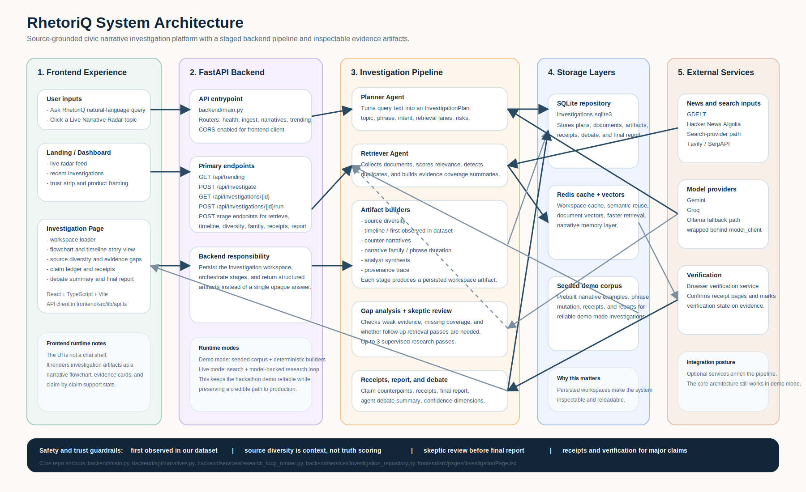
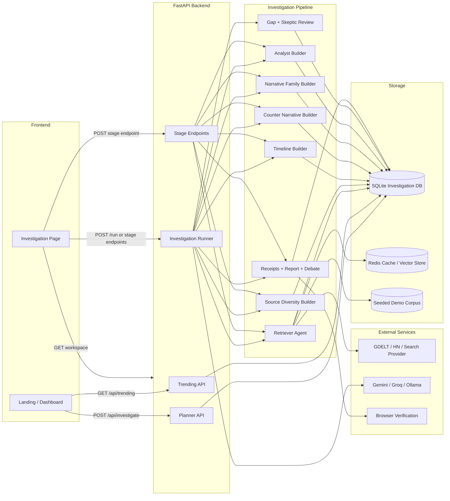

# RhetoriQ System Design

RhetoriQ is a source-grounded civic narrative investigation platform. It helps users trace how political or public-interest narratives appear, mutate, spread, and meet counter-narratives without presenting itself as a truth engine.

This document describes the architecture that exists in the repo today, the data flow between components, and the design decisions that make the system demoable, explainable, and safer than a single-shot chatbot.

## 1. Design goals

The architecture is built around five constraints:

1. **Evidence first**: every major report claim should be traceable to documents and receipts.
2. **Decomposed reasoning**: investigation stages are separated so the system can show timelines, counter-narratives, source diversity, and debate rather than only a final paragraph.
3. **Reliable demo path**: the product must still work in seeded or deterministic mode when live services are unavailable.
4. **Extensible live mode**: the same pipeline can plug into live search, model providers, Redis memory, and page verification.
5. **Cautious civic framing**: the system should say "first observed in our dataset," expose uncertainty, and avoid truth scores or unsupported accusations.

## 2. System overview

At a high level, RhetoriQ has two user-facing entry points:

- **Live Narrative Radar**: a feed of trending narrative topics.
- **Ask RhetoriQ**: a free-text investigation workflow.

Both flows eventually produce or load an **investigation workspace**, which contains the plan, retrieval output, timeline, source diversity, counter-narratives, narrative family, analyst synthesis, receipts, debate summary, and final report.

## 3. Primary flows

### 3.1 Live Narrative Radar

1. The frontend loads trending topics from `GET /api/trending`.
2. The trending backend uses the runtime store, repository, ranker, and detector layers to build a ranked topic feed.
3. A user can open a topic directly or click "Investigate" to create an investigation from that topic.
4. The resulting investigation is persisted and then rendered in the investigation UI.

### 3.2 Ask RhetoriQ

1. The frontend submits `query_text` to `POST /api/investigate`.
2. The planner converts the prompt into a structured `InvestigationPlan`.
3. The plan is persisted as a new investigation workspace in SQLite.
4. The investigation page loads the workspace and either:
   - calls `POST /api/investigations/{id}/run` for the supervised research loop, or
   - calls individual stage endpoints to assemble artifacts incrementally.
5. The frontend adapts the workspace into a narrative flowchart, evidence cards, and final report sections.

## 4. Runtime modes

RhetoriQ intentionally supports two execution modes.

### 4.1 Demo mode

Default configuration uses `DEMO_MODE=true`.

Purpose:

- keep the app reliable during demos
- allow seeded investigations and deterministic builders
- avoid depending on live model credentials

In this mode:

- the planner can fall back to deterministic or mock behavior
- the retriever can use the seeded local corpus
- timeline, counter-narrative, source-diversity, family, analyst, receipts, and debate artifacts can still be built
- the supervised research loop reports `configuration_missing` unless live Gemini or Groq credentials are enabled

### 4.2 Live mode

Live mode requires:

- `DEMO_MODE=false`
- a live model provider such as Gemini or Groq

Optional enrichments in live mode:

- GDELT and Hacker News ingestion
- search-provider retrieval
- Redis semantic cache and vector lookup
- browser-based source verification

This split is deliberate: it lets the team show a polished investigation experience while preserving a path toward real-time, model-backed analysis.

## 5. Frontend architecture

The frontend is a React + TypeScript + Vite application that acts as an investigation surface, not just a wrapper around API text.

### 5.1 Page structure

| Area | Responsibility | Key files |
|---|---|---|
| App shell and routing | Route landing, dashboard, and investigation views | `frontend/src/main.tsx`, `frontend/src/app/routes.tsx` |
| Landing page | Product intro and lightweight trending feed | `frontend/src/pages/LandingPage.tsx` |
| Dashboard | Ask flow, live radar, recent investigations, trust strip | `frontend/src/pages/DashboardPage.tsx` |
| Investigation page | Loads workspaces, triggers runs, renders investigation artifacts | `frontend/src/pages/InvestigationPage.tsx` |

### 5.2 Frontend service layer

The frontend API client in `frontend/src/lib/api.ts` is intentionally thin:

- fetch trending topics
- create investigations
- load recent workspaces
- trigger the supervised run
- trigger individual stage endpoints

This keeps orchestration on the backend, where investigation state is persisted and recoverable.

### 5.3 Frontend data adaptation

The backend returns a rich investigation workspace, but the investigation view needs a UI-specific story shape. `frontend/src/lib/liveInvestigation.ts` adapts the backend workspace into:

- hero metrics
- flowchart nodes and edges
- evidence gap summaries
- claim ledger summaries
- agent debate cards
- recommended checks

This translation layer is important because it separates backend investigation truth from frontend presentation logic.

## 6. Backend architecture

The backend is a FastAPI application that exposes both product-level endpoints and internal stage gates for investigations.

### 6.1 API routers

| Router | Responsibility | Key files |
|---|---|---|
| Health | readiness and basic status | `backend/api/health.py` |
| Ingest | GDELT search, ingestion, store management | `backend/api/ingest.py` |
| Narratives / Investigations | seeded narrative endpoints and workspace-driven investigation APIs | `backend/api/narratives.py` |
| Trending | live radar feed, refresh, topic-to-investigation flow | `backend/api/trending.py` |

The API entrypoint is `backend/main.py`.

### 6.2 Investigation orchestration model

The investigation backend is not a monolithic "ask model -> return answer" design. It separates concerns into:

- **planner agents** for turning a prompt into a structured plan
- **retrieval agents** for gathering and scoring documents
- **deterministic builders** for timeline, diversity, family, receipts, and report shaping
- **skeptic / gap passes** for uncertainty management
- **repositories and caches** for persistence

The central orchestrator for the full run is `backend/services/research_loop_runner.py`.

## 7. Investigation pipeline

The pipeline is designed so each stage produces a named artifact that can be stored, inspected, and shown in the UI.

### 7.1 Planning

The planner stage:

- parses the user prompt
- identifies topic, canonical phrase, and intent
- proposes search and semantic queries
- defines retrieval lanes
- adds risk notes and uncertainty requirements

Key files:

- `backend/agents/planner_agent.py`
- `backend/agents/model_client.py`
- `backend/agents/json_utils.py`

### 7.2 Retrieval

The retriever stage:

- pulls from the seeded corpus in demo mode
- can query live providers in live mode
- scores relevance
- identifies duplicates
- builds coverage summaries
- persists retrieved documents for later stages

Key files:

- `backend/agents/retriever_agent.py`
- `backend/services/search_provider.py`
- `backend/services/page_fetcher.py`
- `backend/services/document_normalizer.py`
- `backend/services/source_profile_enricher.py`

### 7.3 Structured artifact builders

After retrieval, the system builds focused artifacts:

| Stage | Output | Key file |
|---|---|---|
| Source diversity | ecosystem summary with limitations | `backend/services/source_diversity_builder.py` |
| Timeline | chronological spread and first-observed labels | `backend/services/timeline_builder.py` |
| Counter-narratives | opposing or corrective frames | `backend/services/counter_narrative_builder.py` |
| Narrative family | parent frame, branches, phrase mutations | `backend/services/narrative_family_builder.py` |
| Analyst synthesis | observed facts, inferences, uncertainty, checks | `backend/services/analyst_builder.py` |
| Provenance trace | earliest anchors and traceability summary | `backend/services/provenance_trace_builder.py` |
| Gap analysis | missing evidence and retry recommendations | `backend/services/gap_analysis_builder.py` |
| Skeptic review | soften, pass, or retry decisions | `backend/services/skeptic_builder.py` |
| Claim counterpoints | claim-level opposition mapping | `backend/agents/claim_counterpoint_agent.py` |
| Receipts | claim support mapping and support status | `backend/agents/receipts_agent.py`, `backend/services/receipts_builder.py` |
| Final report | final key claims and confidence framing | `backend/services/final_report_builder.py` |
| Agent debate | readable summary of the system's internal checks | `backend/services/agent_debate_builder.py` |

### 7.4 Supervised research loop

The research loop is the most important orchestration concept in the backend.

It can run up to three passes:

1. retrieve evidence across planned lanes
2. build artifacts
3. inspect open gaps and weak claims
4. retry with follow-up queries if the skeptic requires it
5. build receipts and the final report only after evidence review

This matters because the system does not treat the first retrieval result as automatically sufficient.

## 8. Storage and state

RhetoriQ uses layered storage so investigations are both durable and fast to reload.

### 8.1 SQLite investigation store

SQLite is the durable system of record for investigation workspaces.

It stores:

- investigation plans
- retrieved documents
- timeline artifacts
- source-diversity artifacts
- counter-narratives
- narrative families
- gap and skeptic results
- claim ledgers and receipts
- debate summaries
- final reports

Key file:

- `backend/services/investigation_repository.py`

### 8.2 Redis cache and vector memory

Redis is optional but architecturally important.

It supports:

- investigation workspace caching through RedisJSON
- semantic reuse of prior work
- vector indexing for retrieved documents
- faster repeated investigation flows

Key files:

- `backend/services/investigation_cache.py`
- `backend/services/redis_vector_store.py`
- `backend/services/embedding_service.py`

### 8.3 Seeded demo data

The repo includes a seeded demo corpus and precomputed artifacts so the product can reliably demonstrate:

- a main narrative
- phrase mutation
- counter-narratives
- receipts
- report generation

Key file:

- `backend/demo_data.py`

## 9. External integrations

The architecture is intentionally modular around third-party services.

| Integration | Role in architecture | Current posture |
|---|---|---|
| Gemini / Groq / Ollama | planning and live model-backed reasoning | wired through model client abstraction |
| GDELT | public news-style ingestion and search | supported by backend ingest routes |
| Hacker News Algolia | lightweight live ingestion source | supported by backend services |
| Tavily / SerpAPI | search-provider path for retrieval | configurable |
| Browser verification | verify source pages used in receipts | supported by verification and browser agent layers |
| Redis | cache, vector search, narrative memory | optional but integrated |

This keeps the product from being locked to one provider and makes sponsor integrations feel like real architecture, not demo-only add-ons.

## 10. Safety and ethics by design

Safety is embedded into both data structures and stage ordering.

### 10.1 Language guardrails

The system explicitly prefers phrases such as:

- `first observed in our dataset`
- `signals consistent with`
- `requires human review`

It avoids framing such as:

- truth scores
- definitive origin claims
- unsupported manipulation accusations

### 10.2 Structural guardrails

Safety is not only a prompt rule. It is enforced structurally through:

- separate observed-fact vs inference reporting
- source diversity as context, not judgment
- gap analysis before finalization
- skeptic review before report completion
- receipts generation for claim grounding
- verification status attached to evidence

### 10.3 Why this matters

Political narrative analysis is high-risk. The architecture is designed so the system behaves more like an investigation assistant than an authority.

## 11. Current implementation notes

This repo already contains a substantial working architecture, but a few constraints are worth stating clearly:

- the frontend is fully wired and builds successfully
- default demo mode is optimized for reliability, not maximum live autonomy
- the full supervised research loop requires live model configuration
- seeded narrative endpoints and deterministic artifact builders provide a dependable fallback path
- some live integrations are optional and degrade gracefully when unavailable

This is a good hackathon architecture because it supports a polished demo today while preserving a believable path to a production system later.

## 12. Why the architecture fits the product

RhetoriQ would be weaker as a single chat completion. The product needs a system that can:

- retrieve and preserve evidence
- organize narrative spread over time
- compare main and counter frames
- separate observation from interpretation
- expose uncertainty and missing evidence
- let the frontend show the investigation, not just the conclusion

That is why the architecture centers on a persisted investigation workspace and staged artifact generation.

## 13. Key source files

For a fast architecture tour, start here:

1. `backend/main.py`
2. `backend/api/narratives.py`
3. `backend/api/trending.py`
4. `backend/services/research_loop_runner.py`
5. `backend/services/investigation_repository.py`
6. `backend/services/investigation_cache.py`
7. `backend/services/redis_vector_store.py`
8. `frontend/src/lib/api.ts`
9. `frontend/src/lib/liveInvestigation.ts`
10. `frontend/src/pages/InvestigationPage.tsx`

## 14. One-paragraph summary

RhetoriQ uses a React frontend and a FastAPI backend to turn civic narrative questions into structured investigation workspaces. A planner defines the investigation, a retriever gathers evidence from seeded or live sources, deterministic builders assemble timeline, diversity, counter-narrative, family, and analyst artifacts, and a supervised research loop adds skeptic review, receipts, and final report synthesis before the frontend renders the result as an inspectable investigation rather than a black-box answer.
